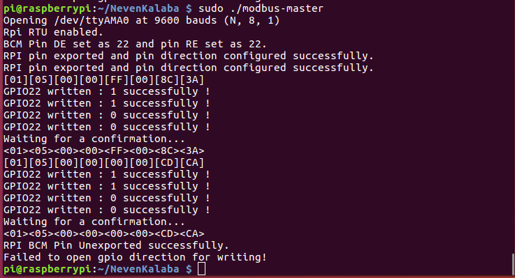

# Modbus RTU logger project

## Задатак:
Реализација *logger*-а *Modbus* саобраћаја преко *Ethernet* мрежног интерфејса.

## *Modbus* протокол

*Modbus* је протокол за комуникацију који је објављен од стране *Modicon*-a (данас *Schneider Electric*) 1979. године, првобитно је служио за комуникацију између *PLC*-oва. *Modbus* је данас постао де факто стандард за комуникацију између индустријских електричних уређаја. Развијен је за индустријске апликације, релативно га је лако примјенити и одржавати у поређењу са другим стандардима и поставља мање ограничења. За комуникацију *Modbus* користи серијски интерфејс, *Ethernet* или *TCP/IP*.


Детаљније информације за *Modbus* протокол могу се наћи на следећем линку:
[*Modbus*](https://en.wikipedia.org/wiki/Modbus)


## *RS-485* трансивер

*RS-485* је полудуплексна *multipoint* мрежа у форми магистрале на коју паралелно може да се повеже до 32 чвора са јединичним оптерећењем. Магистрала мора да буде терминисана на оба краја отпорником чија је отпорност једнака карактеристичној импеданси вода (120 ома за упредену парицу), како би се избјегла рефлексија сигнала. Када је у питању овај пројектни задатак, терминација магистрале је извршена помоћу одговарајућих џампера (енгл. Jumper) као што је приказано на слици испод.


## Хардверска конфигурација мреже

Хардверска конфигурација мреже се састоји из 2 *RPI*-a са одговарајућим *shield*-oвима и једног *Modbus RTU* релејног уређаја.

*Modbus RTU* релејни уређај:


На слици изнад истакнута су 4 релејна излаза, конектор за *Modbus* мрежу са прикључцима A(+) и В(-), као и конектор за напајање од 12 волти једносмјерног напона. Повезивање се остварује тако што се прикључци *RS-485* трансивера, који је повезан са *RPI* платформом, повезују  упреденом парицом са *Modbus* релејним уређајем (А прикључак релејног уређаја иде на плус крај трансивера на *RPI*, a B крај релејног уређаја иде минус крај трансивера на *RPI*). Важно је напоменути да је неопходно извршити терминацију магистрале.

Повезана мрежа:


## Реализација апликација:

За реализацију пројектног задатка кориштена је *libmodbus* библиотека, тачније кориштена измијењена верзија *libmodbus* библиотеке која је прилагођена раду на *raspberry pi* платформи. Осим *libmodbus* библиотеке кориштен је и *BSD sockets API* за подешавање *UDP* сервера који је слао *modbus* пакете преко *Ethernet* мрежног интерфејса.

### Подешавање *libmodbus* библиотеке:


Библиотека *libmodbus* представља имплементацију разлишитих Modbus протокола (*RTU, ASCII, TCP*) у C програмском језику. Ова библиотека пружа *API* који обезбјеђује функције за комуникацију преко *Modbus* протокола. Да би се *libmodbus* могао користити, прво се мора кроскомпајлирати за циљну платфому, у нашем случају то је *raspberry pi*. 

Прво се преузима изворни код библиотеке са следећег гит репозиторијума:

```sh 
git clone --depth=1 https://github.com/dhruvvyas90/libmodbus 
```  
Након преузимања изворног кода, на ред долази кроскомпајлирање за *RPI* платформу. Заједно са изворним кодом долази и *automake build system* за аутоматско компајлирање. Да би могли користити *automake build system* потребно је имати следеће алате на *Linux OS* :
- *automake*
- *autoconf*
- *libtool*

Постојање ових алатa на *OS* може се провјерити следећемо командом:
```sh
dpkg -l automake autoconf libtool
```
Ако не постоје претходно наведени алати, потребно их je инсталирати на *Linux OS* следећом командом:

```sh
sudo apt-get install -y automake autoconf libtool
```
Након што су извршене припреме, на ред долази и кроскомпајлирање, прво се треба направити посебан директоријум у којем ће се налазити бинарна верзија библиотеке, која ће се касније динамички линковати са извршним фајловима апликација које се корите у пројекту, нпр. фолдер *usr*.

```sh
mkdir usr
```
Сада се прелази у фолдер са изворним кодом *libmodbus* библиотеке, и извршава низ команди за генерисање бинарне верзије библиотеке:

```sh
./autogen.sh
./configure ac_cv_func_malloc_0_nonnull=yes --prefix=/path/to/usr --host=arm-linux-gnueabihf
make
make install
```
У претходним командама, опција ```--prefix ``` дефинише на коју локацију ће бити инсталирана бинарна верзија *libmodbus* библиотеке када се позове команда ``` make install```, значи *path/to/usr* треба замијенити са апсолутном путањом до *usr* фолдера. Опцијом ``` --host ``` дефинишемо циљну архитектуру за коју се компајлира библиотека у нашем случају то је *ARM* архитеткура. 

Након кроскомпајлирања библиотеке протебно је бинарни фајл исте пребацити на *RPI* платформу. Пребацује се тако што се повежемо преко *Ethernet* мрежног кабла на *RPI* платформу и позовемо ```scp`` команду. То изгледа овако:
```sh
scp path/to/usr/libmodbus.so.5 pi@ip_address: path/to/destination_folder
```
Када је бинарна верзија библиотеке пребачена на *RPI* платформу потребно је исту поставити у *usr/lib* системски директоријум. Након овог корака могу се покретати апликације које користе  *libmodbus* библиотеку.

Више о  *libmodbus* библиотеци на следећем линку :  [*libmodbus*](https://libmodbus.org/)


## Aпликације *modbus-logger* и *modbus-master* 

### *modbus-master.c*

Ова апликација шаље *Modbus* оквир и укључује први релеј слејва, затим након 5 секунди шаље други *Modbus* оквир и искључује релеј.

У апликацији прво се декларише показивач на специфичну *Modbus* структуру под називом *Modbus kontekst* (``` modbus_t *ctx```), која дефинише параметре *Modbus* протокола, затим се иницијализује контекст *Modbus* протокола позивом ```
 modbus_new_rtu() ``` , што је урађено на следећи начин у коду:
```c

modbus_t *ctx;
ctx = modbus_new_rtu("/dev/ttyAMA0", 9600, 'N', 8, 1);

if (ctx == NULL){
    fprintf(stderr, "Unable to create the libmodbus context!\n");
	return -1;
}
```
Параметри који су прослијеђени ```
 modbus_new_rtu() ``` имају следећа значења:
 - /dev/ttyAMA0  -серијски интерфејс на *RPI* преко којег се комуницира
 - 9600 -биткса брзина преноса поруке
 - `N` -без парности
 - 8 бита података у преносу
 - 1 стоп бит


Након креирања контекста постављамо адресу слејв уређаја са којим се комуницира следећ0м линијома кода:
```c
    modbus_set_slave(ctx, SERVER_ID);
```
Вриједност ``` SERVER_ID ``` је 1, и представља слејв са којим мастер комуницира.

Са следећим дијелом кода се врши конекција на *Modbus* мрежу:
```c
    if (modbus_connect(ctx) == -1)
	{

	fprintf(stderr, "Connection failed.\n");
	modbus_free(ctx);
	return -1;

	}
```

Након овог дијела дефинише се *GPIO* пин преко којег се врши контрола смјера преноса *RS-485* трансивера:

```c
modbus_enable_rpi(ctx, TRUE);
modbus_configure_rpi_bcm_pin(ctx, BCM_PIN_DE);
sleep(1);
modbus_rpi_pin_export_direction(ctx); 
```
Након могу се послати поруке одговарајућем слејв уређају и то се ради на следећи начин:

```c
modbus_write_bit(ctx,COIL_ADDRESS, TRUE);
sleep(5);
modbus_write_bit(ctx,COIL_ADDRESS, FALSE);
```
```COIL_ADDRESS``` представља релејни излаз слејв уређаја са којим се комуницира, његова вриједност је 0, што значи да се сетује први релејни излаз на уређају.


По завршетку комуникације потребно је позвати функцију ``` modbus_rpi_pin_unexport_direction(ctx)```  .


### *modbus-logger.c*

Ова апликација служи за логовање *Modbus* саобраћаја између мастера (*RPI*) и слејва (релејни уређај). Сав логовани саобраћај се шаље запакован у *UDP* пакет преко *Ethernet* мрежног интерфејса на кориснички рачунар, гдје се након тога потврђује исправност послате поруке помоћу *Wireshark* програмског алата. Послате поруке се такође исписују и у терминал оперативног система *RPI*-a који има улогу логера. За реализацију ове апликације осим *libmodbus* библиотеке користи и *BSD Sockets API*, који служи за успоставу *UDP* комуникације. 

Декларације *Modbus* контекста, конекција, постављање *GPIO* пинова, поспремање након завршетка комуникације се врши на исти начин као и у *modbus-master.c*. Апликација може да прослеђује логовани саобраћа као *broadcast* поруку, ако се приликом покретања апликације не прослиједи *IP* адреса рачунара, или ако се прослиједи *IP* адреса, онда се логовани саобраћај шаље на изабрану *IP* адресу.

*BSD Sockets API* већ постоји у оквиру *Linux OS* (више на линку [*BSD Sockets API*](https://en.wikipedia.org/wiki/Berkeley_sockets)) тако да нема потребе за додатним компајлирањем библотека, само је потребно укључити следећа заглавља:
```c
#include <sys/socket.h>
#include <arpa/inet.h>
```
Затим иницијализујемо сокет :
```c
if((socketfd = socket(AF_INET, SOCK_DGRAM, 0)) < 0 ) {
        perror("socket creation failed");
        exit(EXIT_FAILURE);
    }


	int broadcastEnable=1;
	int ret=setsockopt(socketfd, SOL_SOCKET, SO_BROADCAST, &broadcastEnable, sizeof(broadcastEnable));

	memset(&servaddr, 0, sizeof(servaddr));

	servaddr.sin_family    = AF_INET; 
    servaddr.sin_addr.s_addr = inet_addr(send_address);
    servaddr.sin_port = htons(1234);
```

Када смо иницијализовали сокет и *Modbus* конетекст, слиједи дио кода који преузима тј. логује саобраћај са магистрале те прослијеђује даље као *UDP* пакете ка рачунару. За то користимо ```modbus_receive``` функцију из *libmodbus*-a која служи за прихватање порука за магистрале и ```sendto``` функција из *BSD Sockets API*-а која служи за слање поруке на рачунар преко *Ethernet*-a. То је урађено на следећи начин:

```c
while(1)
	{
		if(modbus_receive(ctx,req)<0)
			fprintf(stderr,"Error while recieving frame");
		
		
		for(int i=0;i<MODBUS_RTU_MAX_ADU_LENGTH;i++)
			buffer[i]=req[i];
			


		/* UDP SOCKET KOMUNIKACIJA*/	
 	sendto(socketfd,buffer,MODBUS_RTU_MAX_ADU_LENGTH ,
        0, (const struct sockaddr *) &servaddr, 
            sizeof(servaddr));
		
	}
```
Након завршене комуникације потребно је затворити сокет и очистити креирани *Modbus* контекст:
```c
void free_rec()
{
	modbus_rpi_pin_unexport_direction(ctx);
	modbus_close(ctx);
	modbus_free(ctx);
  	 close(socketfd);
}
```

Написани код се кроскомпајлира следећим командама:

*modbus-logger.c*
```sh
arm-linux-gnueabihf-gcc -o modbus-logger modbus-logger.c -I./usr/include/modbus -L./usr/lib -lmodbus -std=c99
```

*modbus-master.c*
```sh
arm-linux-gnueabihf-gcc -o modbus-master modbus-master.c -I./usr/include/modbus -L./usr/lib -lmodbus -std=c99
```

## Подешавање серијског порта на *RPI* платформи

Прије него што се покрену написане апликације потребно је прво подесити серијски порт на *RPI* платформи. У *Linux OS*, тренутна подешавања серијског порта у оквиру конзоле, могу се приказати командом :
```sh
stty -F /dev/ttyAMA0 -a
```
Опција -F дефинише назив виртуелног фајла серијског порта чије подешавање се жели приказати, док се опцијом -а приказују сва подешавања.

Потребно је подесити битску брзину серијског порта на 9600.
```sh
stty -F /dev/ttyAMA0 9600
```
Такође искључује се и битска парност и ехо.

```sh
stty -F /dev/ttyAMA0 -parenb -echo
```

Након овога могу да се покрену написане апликације и да се тестира мрежа.

## ТЕСТ

На једној *RPI* платформи се покреће *modbus-logger* апликације која ослушкује магистралу и чека на поруке које шаље *modbus-master* са друге *RPI* платформе.

Када се покрене *modbus-master* он шаље следеће поруке:


Са слике видимо да је мастер послао следећи оквир:
``` 
[01] [05] [00] [00] [FF] [00] [8C] [3A]

[01]-slave ID
[05]-функцијски код за упис бита
[00][00]-адреса
[FF][00]-битска комбинација којом се укључује релеј
[ВС][3А]-checksum
```
Када се отвори *Wireshark* алат и сними пакет који је послан од стране *loggera* може се видјети следеће:


На слици се види један *UDP* пакет чији је *payload* *Modbus* оквир који је послан од стране мастера. 

Слично је и за поруку која искључује релеј, гдје једина разлика у ствари у битској комбинацији која искључује релеј и у *checksum*-, што се може и видјети на претходној слици која приказује испис на терминалу мастера.

```sh
ИСТО
[01]-slave ID
[05]-функцијски код за упис бита
[00][00]-адреса
РАЗЛИЧИТО
[00][00]-битска комбинација којом се искључује релеј
[СD][CА]-checksum
```


